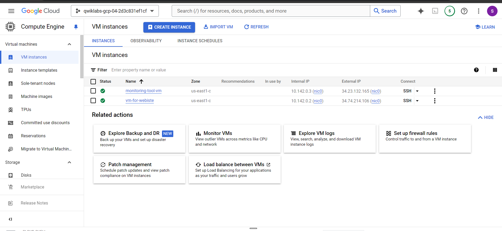
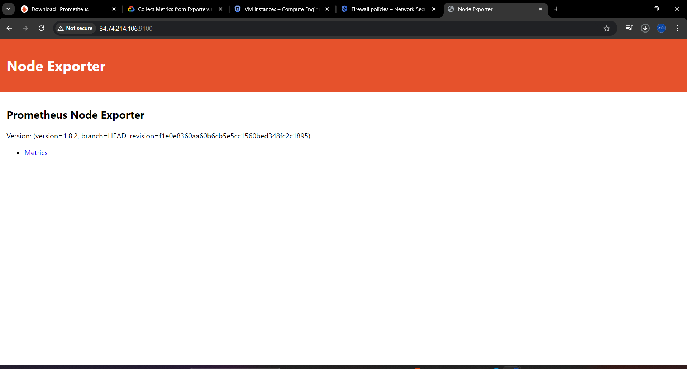
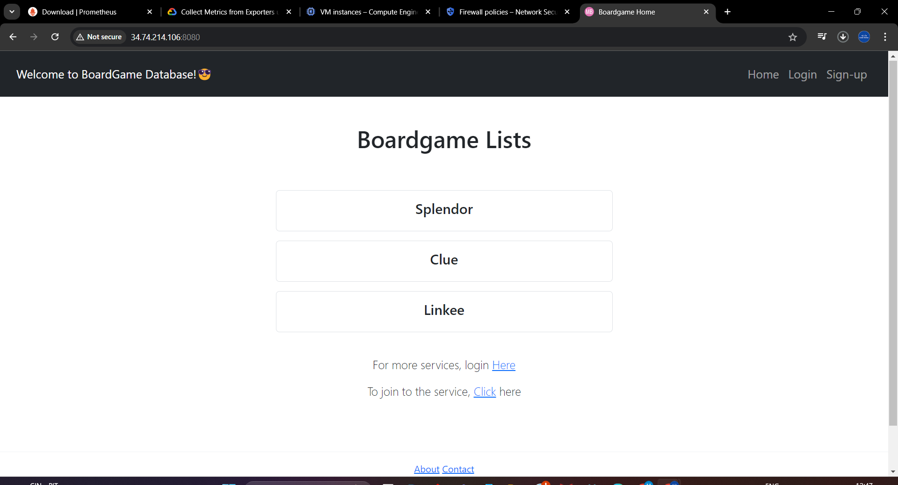
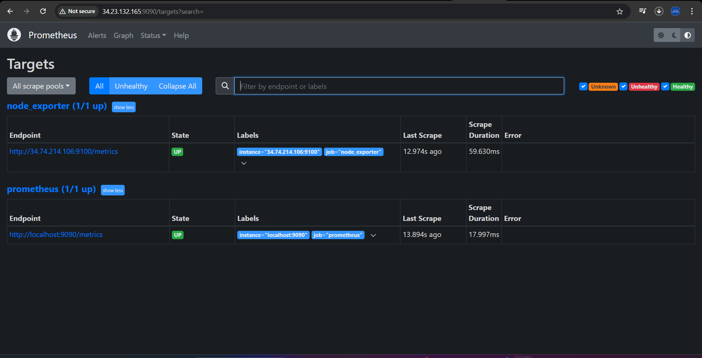
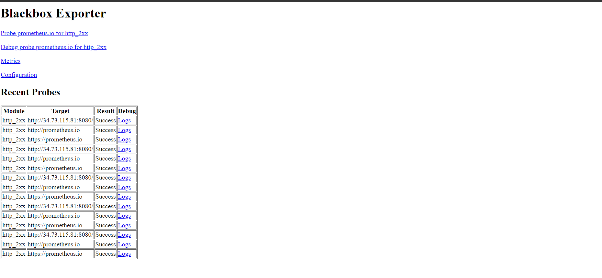
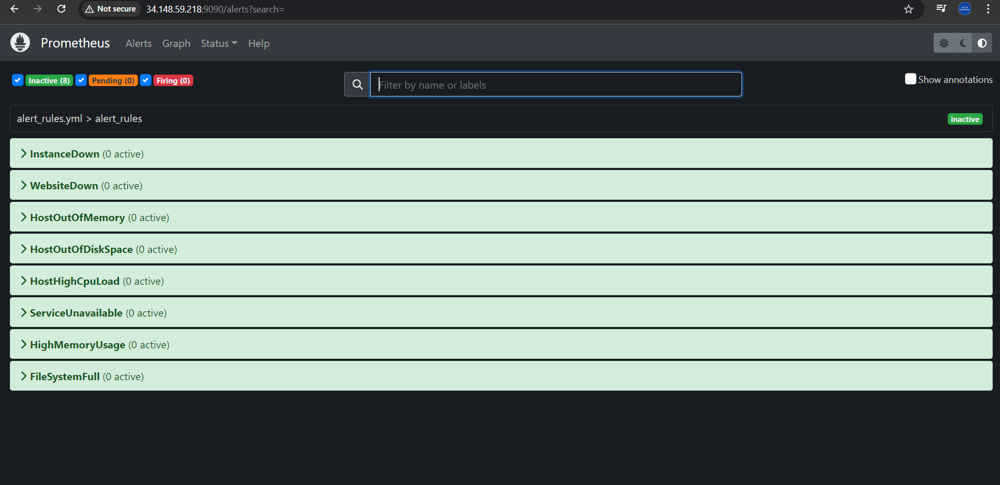
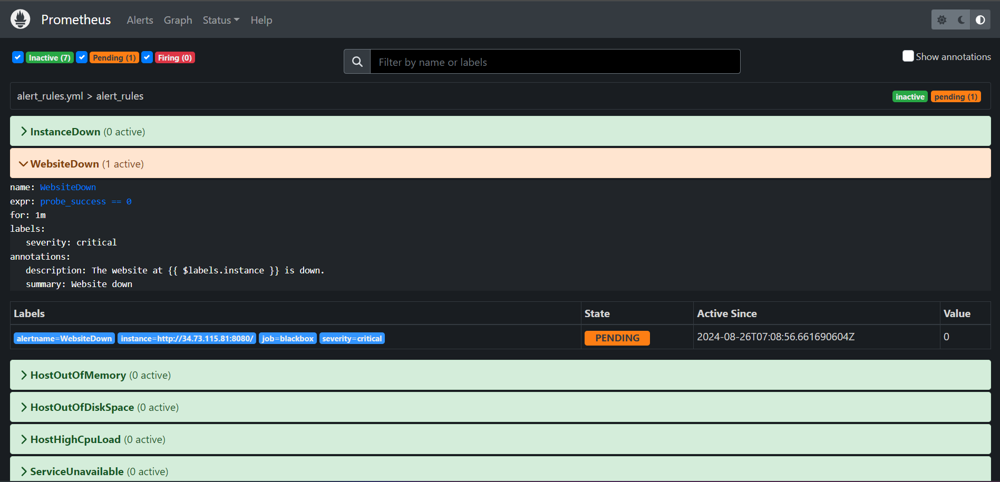
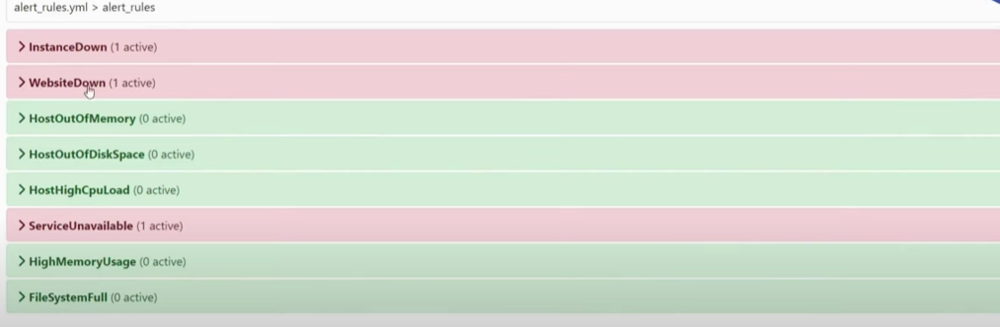
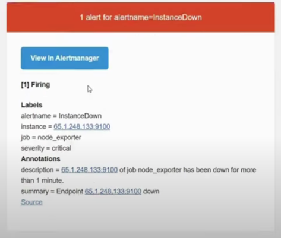

# Real-Time-Monitoring

#### Prerequisites

- Prometheus - is an open-source tool that helps monitor and alert you by collecting, storing, and analyzing data over time from applicaion and infrastructure.
- Black_box_exporter- in Prometheus is a tool that checks if your websites and services are working by testing them from the outside.
- Node Exporter- in Prometheus collects and exposes hardware and OS metrics (like CPU and memory usage) from servers for monitoring.
- Alertmanager-  in Prometheus manages and routes alerts, handling notifications and deduplication for monitoring systems
- Ensure you have `wget` and `tar` installed on both VMs.
- Ensure you have appropriate permissions to download, extract, and run these binaries.
- Replace `<version>` with the appropriate version number you wish to download.
- Make sure you have enable the firewall( To access the specific port).


#### In this project we have to use two instance one for web app and node exporter and another one is for Monitoring tools (Prometheus, Alert Manager and Black box exporter)




#### VM-1 

1. **Download Node Exporter**
   ```bash
   wget https://github.com/prometheus/node_exporter/releases/download/v1.8.1/node_exporter-1.8.1.linux-amd64.tar.gz
   ```

2. **Extract Node Exporter**
   ```bash
   tar -xvf node_exporter-1.8.1.linux-amd64.tar.gz
   ```

3. **Start Node Exporter**
   ```bash
   cd node_exporter-1.8.1.linux-amd64
   ./node_exporter &
   ```


**Clone your web app into instance**

```bash
  git clone "github repo url"
  ```
**Run your web app**
- Access it on the browser.


#### VM-2 (Prometheus, Alertmanager, Blackbox Exporter)

##### Prometheus
1. **Download Prometheus**
   ```bash
   wget https://github.com/prometheus/prometheus/releases/download/v2.52.0/prometheus-2.52.0.linux-amd64.tar.gz
   ```

2. **Extract Prometheus**
   ```bash
   tar xvfz prometheus-2.52.0.linux-amd64.tar.gz
   ```

3. **Configure prometheus.yml**
   ```bash
   vi prometheus.yml               ## write the prometheus.yml code
  ```
4. **Start Prometheus**
   ```bash
   cd prometheus-2.52.0.linux-amd64
   ./prometheus --config.file=prometheus.yml &             # '&' for running in background
   ```

 

##### Alertmanager
1. **Download Alertmanager**
   ```bash
   wget https://github.com/prometheus/alertmanager/releases/download/v0.27.0/alertmanager-0.27.0.linux-amd64.tar.gz
   ```

2. **Extract Alertmanager**
   ```bash
   tar xvfz alertmanager-0.27.0.linux-amd64.tar.gz
   ```
3. **Configure alert_rules**
    ```bash
    nano alertmanager.yml                ## write the alertmanager.yml file inside alertmanager
    ```

4. **Start Alertmanager**
   ```bash
   cd alertmanager-0.27.0.linux-amd64
   ./alertmanager --config.file=alertmanager.yml &
   ```

##### Blackbox Exporter
1. **Download Blackbox Exporter**
   ```bash
   wget https://github.com/prometheus/blackbox_exporter/releases/download/v0.25.0/blackbox_exporter-0.25.0.linux-amd64.tar.gz
   ```

2. **Extract Blackbox Exporter**
   ```bash
   tar xvfz blackbox_exporter-0.25.0.linux-amd64.tar.gz
   ```

3. **Start Blackbox Exporter**
   ```bash
   cd blackbox_exporter-0.25.0.linux-amd64
   ./blackbox_exporter &
   ```



### Notes:
- The `&` at the end of each command ensures the process runs in the background.
- Ensure that you have configured the `prometheus.yml` and `alertmanager.yml` configuration files correctly before starting the services.
- Adjust the firewall and security settings to allow the necessary ports (typically 9090 for Prometheus, 9093 for Alertmanager, 9115 for Blackbox Exporter, and 9100 for Node Exporter) to be accessible.

**Website Healthy**



**Instance Down**


**Service Down**


**When service goes down for mention duration you will get alert mail**



  

